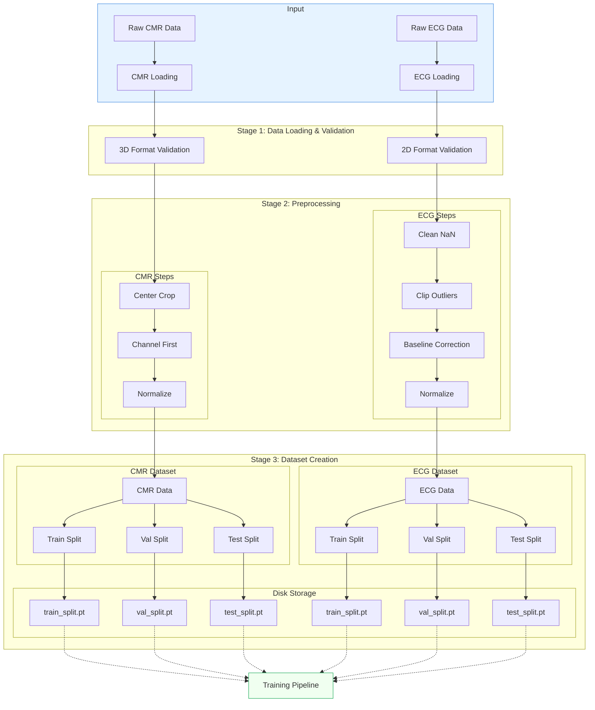

# Data Preprocessing Pipeline

## Overview

The preprocessing pipeline is a crucial component that transforms raw medical data into a standardized format suitable for model training and evaluation. It handles two main modalities:

- **CMR (Cardiac Magnetic Resonance)**: Image preprocessing including resizing and normalization
- **ECG (Electrocardiogram)**: Signal processing including sequence standardization and various normalization strategies

The following diagram illustrates the complete preprocessing workflow for both modalities, from raw data ingestion to the final preprocessed tensors that can be picked up by the training pipeline. Note that CMR and ECG data require different preprocessing approaches due to their distinct nature (image vs signal data) and are therefore processed and stored separately.



## Pipeline Stages

### Stage 1: Data Loading & Validation

Each modality undergoes initial validation to ensure data integrity:

- **CMR Data**: 
  - Validates 3D format (height × width × 3 slices)
  - Checks for expected dimensionality and slice count
  - Ensures data consistency across samples

- **ECG Data**:
  - Validates 2D format (12 leads × samples)
  - Verifies the presence of all 12 ECG leads
  - Checks signal length (expected: 5000 samples at 500Hz)

### Stage 2: Preprocessing

#### CMR Processing Steps

1. **Center Crop**: 
      - Standardizes image size to 210×210 pixels
      - Centers the heart in the frame using center crop/pad operations
   
2. **Channel First**: 
      - Transposes data to PyTorch format (3×210×210)
      - Arranges slices as channels for model input

3. **Normalize**: 
      - Scales pixel intensities to [0,1] range per slice
      - Enhances contrast and standardizes input range

#### ECG Processing Steps
1. **Clean NaN**: 
      - Replaces NaN values with appropriate numerical values
      - Ensures signal continuity

2. **Clip Outliers**: 
      - Removes extreme values beyond ±4 standard deviations
      - Reduces impact of artifacts and noise

3. **Baseline Correction**: 
      - Applies Asymmetric Least Squares Smoothing
      - Removes baseline wander while preserving signal peaks
      - Uses optimized parameters (λ=1e7, p=0.3, iterations=5)

4. **Normalize**: 
      - Applies group-wise normalization
      - Groups leads into anatomical sets [1-3, 4-6, 7-12]
      - Standardizes signal amplitude across lead groups

### Stage 3: Dataset Creation

The preprocessed data can be organized into either standard train/val/test splits or k-fold cross-validation splits:

1. **Standard Split Creation**:
      - Data is split while maintaining patient-level separation
      - Each modality maintains its own splits
      - Default split ratios: 80% train, 10% validation, 10% test
      - Storage format:
        ```
        train_split.pt
        val_split.pt
        test_split.pt
        ```

2. **K-Fold Cross-Validation**:
      - Supports stratified k-fold partitioning for robust model evaluation
      - Maintains class balance across folds
      - Each fold creates train and validation splits
      - Storage format for k folds:
        ```
        fold_1_train_split.pt, fold_1_val_split.pt
        fold_2_train_split.pt, fold_2_val_split.pt
        ...
        fold_k_train_split.pt, fold_k_val_split.pt
        ```

To create k-fold splits, use the partitioning script with the following options:

```bash
python src/data/partitioning.py \
    --split_type stratified_kfold \
    --n_folds 5 \
    --output_dir path/to/output
```

For running experiments with k-fold cross-validation, Hydra sweeps are used:

```bash
# Run all folds
python train.py experiment=fine_tuning/cmr_acdc_cv # multirun is defined in the experiment config

# Run specific folds
python train.py experiment=fine_tuning/cmr_acdc_cv hydra.sweeper.params.+fold=1,3,5
```

The cross-validation configuration automatically:
- Runs the experiment for each fold
- Uses the appropriate train/val splits for each fold
- Maintains consistent data loading and augmentation across folds

## Usage

The preprocessing pipeline can be run using the main script:

```bash
python src/data/preprocessing/main.py --config-name preprocess
```

For configuration options and customization, refer to the [Configuration Guide](../getting-started/configuration.md).

### Stage 1: Data Preprocessing

The preprocessing script (`src/data/preprocessing/main.py`) provides a unified interface for handling different medical imaging modalities. It's designed to be:

- **Modality-Agnostic**: Common interface for both CMR and ECG data
- **Efficient**: Supports parallel processing for large datasets
- **Robust**: Includes data validation and comprehensive error handling
- **Flexible**: Configurable preprocessing parameters per modality
- **Maintainable**: Detailed logging and progress tracking

::: src.data.preprocessing.main
    options:
        show_root_heading: false
        heading_level: 4
        show_source: true
        members: [process_dataset]

#### Getting Started

The basic workflow involves selecting a dataset to process and configuring the preprocessing parameters:

```bash
# Basic usage
rye run preprocess --data_root data --dataset acdc --max_workers 5
```

#### Common Configuration Options

These options apply to all datasets regardless of modality:

- `--data_root`: Root directory containing raw data
- `--dataset`: Unique dataset key to process (e.g., 'acdc', 'ptbxl')
- `--max_workers`: Number of workers for parallel processing (optional)
- `--force_restart`: Force restart preprocessing from scratch
- `--clean_interim`: Clean interim directory after processing

#### Modality-Specific Options

Different modalities require different preprocessing steps and parameters:

##### CMR Processing
```bash
rye run preprocess \
    --data_root data \
    --dataset acdc \
    --image_size 256 \
    --normalize \
    --max_workers 5
```

**Parameters**:
- `--image_size`: Target size for image resizing (default: 256)
- `--normalize`: Apply intensity normalization (default: True)


##### ECG Processing
```bash
rye run preprocess \
    --data_root data \
    --dataset ptbxl \
    --sequence_length 5000 \
    --normalize_mode group_wise \
    --max_workers 5
```

**Parameters**:
- `--sequence_length`: Desired sequence length (default: 5000)
- `--normalize_mode`: Normalization strategy (choices: sample_wise, channel_wise, group_wise)

#### Monitoring and Debugging

The preprocessing script maintains detailed logs to help track progress and debug issues:

- **Log Location**: `logs/preprocessing.log`
- **Log Features**:
    - Rotating file handler (max 1MB per file, 5 backup files)
    - Console output for immediate feedback
    - Debug-level logging to file
    - Detailed error tracking and stack traces

### Stage 2: Dataset Partitioning

After preprocessing, the data needs to be split into training, validation, and test sets. The partitioning script (`src/data/partitioning.py`) provides:

- Random and stratified splitting strategies
- Configurable split sizes
- Optional train subset creation
- Automatic sanity checks for data leakage
- Comprehensive split statistics

::: src.data.partitioning
    options:
        heading_level: 4
        show_source: true
        members: [DatasetSplit, PartitioningConfig, create_splits]

#### Basic Usage

Here's how to create dataset splits programmatically:

```python
from src.data.partitioning import PartitioningConfig, create_splits
from pathlib import Path

# Configure splitting
config = PartitioningConfig(
    split_type="random",  # or "stratified"
    val_size=0.1,
    test_size=0.1,
    train_subsample_size=None,  # Optional: create smaller training subset
    random_seed=1337,
    output_dir=Path("data/processed/acdc")
)

# Create splits
splits = create_splits(
    sample_ids=sample_ids,
    config=config,
    targets=targets  # Optional, required for stratified splits
)
```

#### Command-Line Interface

For command-line usage:

```bash
# Random split
rye run partition \
    --data_dir data/interim/acdc \
    --output_dir data/processed/acdc \
    --split_type random

# Stratified split (requires targets)
rye run partition \
    --data_dir data/interim/acdc \
    --output_dir data/processed/acdc \
    --split_type stratified
```

#### Configuration Options

- `--split_type`: Type of split to create
  - `random`: Simple random split
  - `stratified`: Split preserving class distribution
- `--val_size`: Validation set size as fraction (default: 0.1)
- `--test_size`: Test set size as fraction (default: 0.1)
- `--train_subsample_size`: Optional size for train subset as fraction for faster debugging
- `--random_seed`: Random seed for reproducibility (default: 1337)

#### Output Structure

The partitioning script generates several output files:

- `splits.json`: Contains the mapping of record IDs to each split
- `partitioning_cfg.json`: Records the configuration used for splitting
- `{split_name}_split.pt`: Tensor data files for each split (train/val/test)

Each split file contains:
- Preprocessed data tensors
- Associated targets/labels
- Record IDs for traceability
- Metadata for reproduction

## Complete Pipeline Example

Here's a complete example showing how to preprocess and partition a CMR dataset:

```bash
# 1. Preprocess the raw data
rye run preprocess \
    --data_root data \
    --dataset acdc \
    --max_workers 5

# 2. Create dataset splits
rye run partition \
    --data_dir data/interim/acdc \
    --output_dir data/processed/acdc \
    --split_type random
```

### Expected Directory Structure

After running the complete pipeline, your data directory should look like this:

```
data/
├── raw/                            # Original raw data
│   └── acdc/                       # ACDC dataset raw files
│       ├── patient001/             # Patient-specific directories
│       ├── patient002/
│       └── ...
├── interim/                        # Preprocessed data
│   └── acdc/                       # ACDC preprocessed files
│       ├── patient001.pt           # Preprocessed patient data
│       ├── patient002.pt
│       └── ...
└── processed/                      # Final processed and split data
    └── acdc/                       # ACDC dataset splits
        ├── train_split.pt          # Training data
        ├── val_split.pt            # Validation data
        ├── test_split.pt           # Test data
        ├── splits.json             # Split configuration and indices
        └── partitioning_cfg.json   # Partitioning configuration
        └── metadata.db             # Record metadata
```

!!! note "Reproducibility with Weights & Biases"
    When using Weights & Biases logging during training, the splits configuration file (`splits.json`) is automatically uploaded as a W&B artifact. This ensures:
    
    - Complete reproducibility of dataset splits across runs
    - Easy tracking of which splits were used in each experiment
    - Ability to reuse exact splits for comparative experiments
    - Version control of dataset partitioning

    You can access these splits through the W&B UI or programmatically using the W&B API.


After all steps, your should be able to start training. See [Training Models](../models/training.md) for more information.