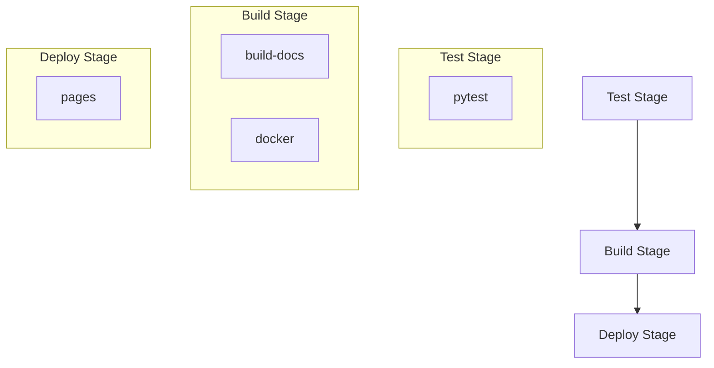

# CI/CD Pipeline

This project uses [GitLab CI/CD](https://docs.gitlab.com/ci/) for automated testing, building, and deployment. The pipeline is designed to be efficient and provide fast feedback while ensuring code quality.

## Pipeline Structure

The pipeline is organized into three main stages:

1. `test` - Runs tests and quality checks
2. `build` - Builds documentation and Docker images
3. `deploy` - Deploys documentation to GitLab Pages

## Jobs Overview

### Test Stage

#### `pytest`
- Runs Python tests using pytest
- Uses Rye for dependency management
- Generates test reports and coverage information
- Must pass before proceeding to build stage

### Build Stage

#### `build-docs`
- Builds project documentation using MkDocs
- Creates documentation site in `site/` directory
- Supports preview builds for merge requests

#### `docker`
- Builds and publishes Docker images
- Pushes to both GitLab Registry and Docker Hub
- Tags:
  - For merge requests: `mr-{MR_ID}`
  - For branches: Branch name (sanitized)
  - For default branch: Also tags as `latest`

### Deploy Stage

#### `pages`
- Deploys documentation to GitLab Pages
- Combines Quarto book and MkDocs documentation
- Supports preview deployments for merge requests
- URLs:
  - Main site: `https://<namespace>.gitlab.io/<project>/`
  - MR previews: `https://<namespace>.gitlab.io/<project>/mr-{MR_ID}/`

## Pipeline Features

### Auto-cancellation
- Redundant pipelines are automatically cancelled
- Only the latest pipeline for a branch/MR runs
- All jobs are interruptible for quick cancellation

### Caching
- Python dependencies cached using Rye
- Docker layer caching for faster builds
- Test cache for pytest

### Dependencies
- Build stage requires successful tests
- Pages deployment requires successful documentation build

### Preview Environments
- Merge requests get their own preview environments
- Documentation and Docker images are tagged with MR ID
- Easy review of changes before merging

## Common Rules

The pipeline runs in two scenarios:

1. On the default branch (main/master)
2. For merge requests

This ensures we:

- Always test and build merge requests
- Keep the default branch deployments up to date
- Don't waste CI minutes on other branches

## Environment Variables Required

The pipeline needs these variables configured in GitLab:

- `DOCKER_HUB_USERNAME` - Docker Hub username
- `DOCKER_HUB_PASSWORD` - Docker Hub password/token
- GitLab automatically provides CI/CD variables like `CI_REGISTRY_*` 