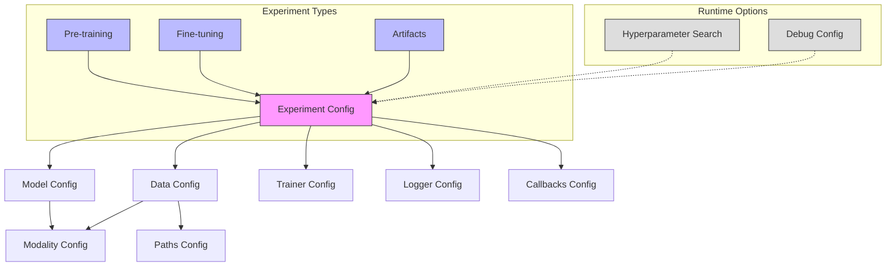

# Configuration System

The project uses [Hydra](https://hydra.cc/) for managing configurations. This provides a flexible, hierarchical configuration system that allows for easy experiment management and reproducibility.

## Structure

The configuration is organized into several main components. Each component covers one part of the entire deep learning pipeline and serves as a base and be selectively overridden in subsequent configurations, which makes the system very versatile and adaptable.

```text
configs/
├── data/               # Dataset configurations
├── model/              # Model architectures and parameters
├── trainer/            # Training settings and hyperparameters
├── callbacks/          # Training callbacks (early stopping, checkpointing)
├── logger/             # Logging configurations (W&B, TensorBoard)
├── paths/              # Path configurations
├── experiment/         # Complete experiment configurations
├── modality/           # Modality-specific settings
├── debug/              # Debug configurations
├── extras/             # Additional configuration components
├── hparams_search/     # Hyperparameter optimization settings
└── hydra/              # Hydra-specific configurations 
```

The following graph shows the configuration relationship.



## Core Components

### Data Configuration

The data configuration controls dataset loading and preprocessing:

```yaml
--8<-- "configs/data/default.yaml"
```

Modality-specific configurations extend the default, like in the following example for CMR:

```yaml
--8<-- "configs/data/cmr.yaml"
```

### Modality Configuration

Modality-specific configurations are closely tied to the data configuration but yet distinct. They define dataset specifics suchas the number of classes for a supervised task. For example, the `acdc.yaml` configuration for the CMR modality defines the number of classes as `5`.

```yaml
--8<-- "configs/modality/cmr/acdc.yaml"
```

### Model Configuration

Model configurations define architecture and training specifics:

```yaml
--8<-- "configs/model/ecg_classifier.yaml"
```

For more details on model specifics, see the [Model Architectures](../models/architectures.md) section.

### Training Configuration

Training settings control the training process:

```yaml
--8<-- "configs/trainer/default.yaml"
```

## Experiment Configuration

Experiments are the highest-level configuration component, bringing together all other core components into a complete setup. An experiment configuration defines how all components interact to create a complete training system. Here's a comprehensive example of the `ecg_arrhythmia` experiment coupling the ECG modality, Arrhythmia dataset and ECG classifier into a complete configuration:

```yaml
--8<-- "configs/experiment/fine_tuning/ecg_arrhythmia.yaml"
```

This example demonstrates how an experiment configuration:

- Specifies the model architecture and its hyperparameters
- Defines data loading and augmentation pipeline
- Sets up training parameters and optimization strategy
- Selectively overrides desired components

### Types

The following sections describe the three main archetypes of experiments supported by our configuration system. Each type builds upon the core components above but serves a distinct purpose in the model development lifecycle.

- **Pre-training**: Pre-training a model on a large dataset for self-supervised learning.
- **Fine-tuning**: Fine-tuning a model on a specific task using a pre-trained backbone.
- **Embeddings/Artifacts**: Generating embeddings and saliency maps for a given dataset using a pre-trained model.


## Runtime Features

The configuration system provides several powerful runtime features that allow you to modify and extend experiment configurations without changing the base configuration files.

### Hyperparameter Optimization

For hyperparameter search:

```bash
# Run hyperparameter search for training
rye run train -m hparams_search=cmr_classifier

# Evaluate best model from sweep
rye run eval experiment=cmr_acdc ckpt_path=path/to/best_model
```

### Multi-Run Experiments

Run multiple configurations:

```bash
# Training with different mask ratios
rye run train -m model.mask_ratio=0.65,0.75,0.85

# Evaluate multiple checkpoints
rye run eval -m ckpt_path=path/to/ckpt1,path/to/ckpt2

# Generate artifacts for multiple models
rye run generate_artifacts -m ckpt_path=path/to/ckpt1,path/to/ckpt2
```

### Command Line Overrides

Override any configuration value:

```bash
# Training overrides
rye run train experiment=mae_pretraining trainer.max_epochs=200 data.batch_size=32

# Evaluation overrides
rye run eval experiment=mae_pretraining ckpt_path=path/to/model data.batch_size=64

# Artifact generation overrides
rye run generate_artifacts experiment=extract_features \
    ckpt_path=path/to/model accelerator=gpu splits=[train,test]
```

### Debug Mode

For development and debugging:

```bash
# Debug training
rye run train +debug=default

# Debug evaluation
rye run eval +debug=default debug.log_level=DEBUG

# Debug artifact generation
rye run generate_artifacts +debug=default debug.enabled=true
```

## Configuration Reference

### Available Configurations

#### Data Configs
- `data/default.yaml`: Base dataset configuration
- `data/cmr.yaml`: CMR dataset settings
- `data/ecg.yaml`: ECG dataset settings

#### Model Configs
- `model/mae.yaml`: Masked Autoencoder
- `model/sim_clr.yaml`: SimCLR model
- `model/cmr_encoder.yaml`: CMR encoder (backbone of CMR classifier)
- `model/ecg_encoder.yaml`: ECG encoder (backbone of ECG classifier)
- `model/cmr_classifier.yaml`: CMR classifier
- `model/ecg_classifier.yaml`: ECG classifier

#### Trainer Configs
- `trainer/default.yaml`: Default training settings

#### Experiment Configs
Various predefined experiment configurations combining the above components.

## Debugging Configurations

As this can grow quite complex, debugging can be useful.

To debug your configuration:

```bash
# Print the full config
rye run train --cfg job
```